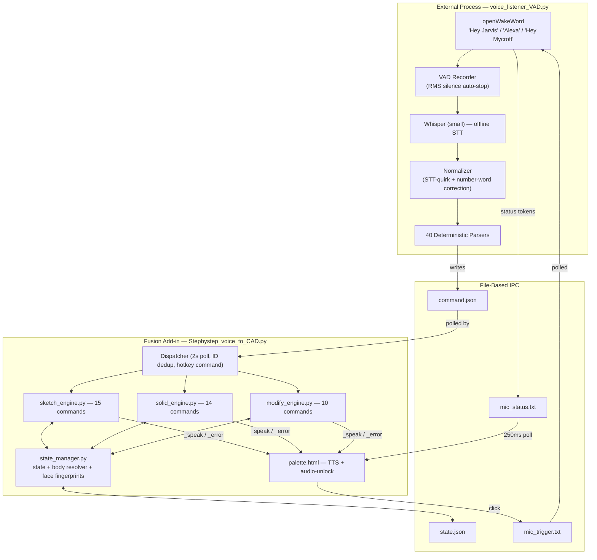

# StepByStepCAD — Voice-Controlled Parametric CAD for Autodesk Fusion 360

> A fully offline, deterministic voice-command system that drives Fusion 360's parametric modeling workflow by speech — without handing geometric control to an AI.


-green)
-purple)


---

## Demo

[](https://youtu.be/4cAQCI9BKyU)

*Wake-word activation → spoken sketch and solid commands → voice-confirmed feature creation, executed live in Fusion 360 with minimal mouse input.*

---

## Table of Contents

1. [What This Is (and Isn't)](#1-what-this-is-and-isnt)
2. [Architecture](#2-architecture)
3. [Repository Structure](#3-repository-structure)
4. [Installation & Quick Start](#4-installation--quick-start)
5. [Behaviour You Must Know Before Speaking](#5-behaviour-you-must-know-before-speaking)
6. [Complete Command Reference (A–Z)](#6-complete-command-reference-az)
7. [Worked Examples](#7-worked-examples)
8. [Engineering Rigor — Fix Register](#8-engineering-rigor--fix-register)
9. [Roadmap](#9-roadmap)
10. [Project Context](#10-project-context)

---

## 1. What This Is (and Isn't)

Most "AI + CAD" tools *generate* geometry from a vague prompt. StepByStepCAD does the opposite: it removes the mouse and dialog boxes from between an engineer who already knows exactly what they want, and Fusion's feature tree.

| | AI Geometry Generators | **StepByStepCAD** |
|---|---|---|
| Who sets dimensions? | The model infers them | **The designer states them — always** |
| Parsing | LLM inference (probabilistic) | **Deterministic regex grammar** |
| Same input → same output? | Not guaranteed | **Guaranteed** |
| Network required? | Yes | **No — 100% offline** |
| Failure mode | Silent wrong geometry | **Explicit spoken error + guidance** |

Four non-negotiable design rules run through every file in this repository:

1. Never silent wrong geometry
2. Always spoken errors over crashes
3. Minimal mouse usage
4. Deterministic parsing — no inference, ever

There is no LLM, no trained network, and no proprietary dataset anywhere in the pipeline — only a deterministic grammar. Nothing is approximated or filled in, which makes every output reproducible and auditable.

**On offline operation:** the entire speech pipeline — wake-word detection, transcription, and command parsing — runs on-device and requires no network connection, so no design data leaves the machine. Fusion 360 itself of course continues to operate with its usual cloud connectivity; this add-in simply introduces no additional network dependency of its own.

**On mouse usage:** voice is primary, but the mouse is retained deliberately. Spatial selection ("which edge?") is a poor fit for speech, so the workflow is hybrid — click the edge, then speak the feature. Manual input is minimal but intentional, not an unresolved gap.

---

## 2. Architecture

Two decoupled processes communicate through file-based IPC, because Fusion's embedded Python cannot safely host audio/ML workloads on its main thread.



**Voice feedback is two-way.** Every confirmation, index, and actionable error is spoken back through the palette's Web Speech API — this is the accessibility backbone for blind and low-vision engineers: correctness never depends on the user seeing the screen.

---

## 3. Repository Structure

```
StepByStepCAD_VoiceAuto/
├── voice_listener_VAD.py          # External: wake word + STT + NLP parsers
├── Stepbystep_voice_to_CAD.py     # Fusion add-in entry point / dispatcher / hotkey
├── Stepbystep_voice_to_CAD.manifest
├── sketch_engine.py                # 2D sketch commands
├── solid_engine.py                 # 3D solid feature commands
├── modify_engine.py                # Fillet/chamfer + interactive queries
├── state_manager.py                # State store + body resolver + face fingerprinting
├── command_reader.py               # command.json I/O + ID dedup
├── palette.html                    # Floating UI + TTS (rewritten from add-in on boot)
├── command.json / state.json       # Runtime IPC files (auto-generated on first run)
└── __init__.py
```

| File | Role |
|---|---|
| `voice_listener_VAD.py` | Wake-word detection → VAD-based recording → Whisper transcription → normalization → one of 40 regex parsers → writes `command.json`. No parser ever invents a number the user didn't say. |
| `Stepbystep_voice_to_CAD.py` | Owns the palette, polls `command.json` every 2 s, marshals execution onto Fusion's main thread, registers the record hotkey command, injects `_speak`/`_error` into all three engines. |
| `sketch_engine.py` | Sketch/plane creation, lines, rectangles, circles, polygons, trim, arc trim, constraints, mirror, point read-back, finish sketch. Auto-corrects Y-axis direction per plane, and always edits whatever sketch is *actually open in Fusion*, not just what state last recorded. |
| `solid_engine.py` | Extrude (profile/face/ring), revolve, hole, threads, mirror, patterns, feature repeat, timeline browsing. |
| `modify_engine.py` | Fillet, chamfer, body visibility, and the click-then-speak query trio (edge/face/profile) plus multi-body browsing. |
| `state_manager.py` | Persistent JSON memory: last sketch/body/face/feature, plus a shared body-resolver (blocks ambiguous multi-body commands instead of guessing) and a face-fingerprint store (blocks stale face indices after the model changes). |
| `command_reader.py` | Exactly-once execution via monotonic command IDs. |
| `palette.html` | Dark floating panel: RECORD button, colour-coded log, TTS with an autoplay-unlock listener so wake-word-only sessions still speak. |

> `command.json`, `state.json`, `mic_trigger.txt`, and `mic_status.txt` are runtime files. They are generated automatically on first run and are intentionally excluded from version control.

---

## 4. Installation & Quick Start

**Requirements:** Autodesk Fusion 360 (Windows/macOS), Python 3.9+, a microphone.

```bash
# 1. Copy this folder into Fusion's add-ins directory:
#    Windows: %APPDATA%\Autodesk\Autodesk Fusion 360\API\AddIns\Stepbystep_voice_to_CAD\
# In Fusion: Utilities → Add-Ins → Stepbystep_voice_to_CAD → Run
#   (the floating voice panel opens)

# 2. Install listener dependencies (one-time)
pip install openai-whisper sounddevice numpy openwakeword

# 3. Start the external listener
python voice_listener_VAD.py

# Optional flags:
#   --model base          faster transcription (recommended while screen recording)
#   --threshold 0.4       looser wake-word detection
#   --addin-dir "<path>"  point explicitly at the add-in folder
```

No accounts, no API keys. Models download once on first run and cache locally; every subsequent run is fully offline.

**Optional one-time setup — keyboard shortcut:** in Fusion, locate **"StepByStepCAD Record"**, right-click → *Change Keyboard Shortcut* → assign `Ctrl+Shift+R`. Fusion remembers it thereafter.

Then simply speak: *"Hey Jarvis… create sketch on X Y plane."*

---

## 5. Behaviour You Must Know Before Speaking

These five behaviours are not obvious from the command names, and each will produce a technically correct but unexpected result if you don't know it.

### 5.1 Cuts are symmetric — speak double the depth you want

Fusion's Python API raises `RuntimeError 3` when a one-sided extent is combined with a cut operation. The engine therefore always uses a **symmetric full-length extent** for cuts, meaning the distance you speak is the **total span, split evenly on both sides of the sketch plane**.

**Practical consequence: to cut a pocket 3 mm deep, say "extrude cut 6".**

| You say | Total span | Actual depth into material |
|---|---|---|
| "extrude cut 6" | 6 mm | **3 mm** |
| "extrude cut 20" | 20 mm | **10 mm** |
| "extrude cut 30" | 30 mm | **15 mm** |

To cut cleanly *through* a plate of thickness *T*, speak a value greater than **2 × T**.

The same rule applies whenever you say **"symmetric"** with a join or new-body extrude, and to any cut reproduced by `repeat_feature`. It does **not** apply to `hole` (which uses a true one-sided depth — say exactly the depth you want) or to `extrude_face`.

### 5.2 Positive Y is always upward

Fusion's sketch-local Y axis points in different global directions depending on the plane (XZ and YZ map local Y to global −Z). The engine reads the live axis direction and flips signs transparently, so "positive Y = upward" is true from your point of view on every plane and face. You never need to reason about this.

### 5.3 All dimensions are millimetres

Every spoken number is interpreted as mm (or degrees for angles). Conversion to Fusion's internal centimetre units is handled internally.

### 5.4 Multiple bodies require an explicit choice

If more than one solid body exists and none is active, body-dependent commands refuse rather than guessing, and speak: *"Multiple bodies exist and none is currently selected. Say show bodies, then select body, followed by a number…"* Say **"show bodies"** then **"select body N"** to proceed.

### 5.5 Face indices are verified, not trusted

Face numbering is an internal Fusion artifact that can change when topology changes. Every face index recorded via `show_faces` or `select_face` is fingerprinted (centroid + normal + area) and re-verified before use. If the geometry at that index has changed, the command is blocked with a spoken warning rather than sketching on the wrong face.

---

## 6. Complete Command Reference (A–Z)

### How to give a command

1. Say the wake word — **"Hey Jarvis"**, **"Alexa"**, or **"Hey Mycroft"** — or click **RECORD**, or press your assigned hotkey.
2. Speak the command. Numbers work as digits or words ("three" and "3" both parse).
3. Listen — the system always speaks back a confirmation, an index, or an explicit error.

**Legend:** 🖱️ mouse action required first · 🗣️ what to say · 📥 parameters and defaults · ✅ result and spoken reply

### Prerequisite cheat-sheet

| If a command needs... | Do this first |
|---|---|
| **An active sketch** (Line, Rectangle, Circle, Polygon, Trim, Constraints) | Say **Create Sketch** |
| **A finished profile** (Extrude, Revolve) | Say **Finish Sketch** after drawing |
| **A solid body** (Fillet, Chamfer, Hole, Thread, Extrude Face, Mirror Body, Patterns) | Complete at least one Extrude |
| **An edge number** (Fillet, Chamfer) | 🖱️ Click the edge → say **Select Edge** |
| **A face number** (Extrude Face, Create Sketch on a face index) | Say **Show Faces** (no click), or 🖱️ click the face → **Select Face** |
| **A curve number** (Trim Arc, Restore Circle, Add Constraint, Extrude Ring) | Say **Show Curves** (no click) |
| **A body number** (Select Body) | Say **Show Bodies** (no click) |
| **A feature number** (Mirror Feature, Patterns) | Say **Show Features** (no click), or omit it to target your most recent feature |

---

### A

#### Add Constraint — `add_constraint`
**Sketch** · Needs: an active sketch and curve numbers from **Show Curves**
- 🖱️ No click needed.
- 🗣️ **"tangent [A] [B]"** · **"parallel [A] [B]"** · **"perpendicular [A] [B]"** · **"symmetric [A] [B] [mirror line]"**
- 📥 Two curve numbers; symmetric needs a third (a straight line to mirror about).
- ✅ Applies the constraint. *"Tangent constraint applied between curve 0 and curve 1."*

---

### B

#### Body Visibility — `body_visibility`
**Modify** · Needs: an existing solid body
- 🖱️ No click needed.
- 🗣️ **"hide body"** / **"show body"** (also "unhide body", "reveal body")
- 📥 None.
- ✅ Toggles visibility of the active body. *"Body is now hidden."* / *"Body is now visible."*

---

### C

#### Chamfer — `chamfer`
**Modify** · Needs: a solid body and an edge number
- 🖱️ Click the edge, then say **Select Edge** to hear its number.
- 🗣️ **"chamfer distance [N] edge [N]"** (also "bevel edge [N]")
- 📥 `distance` in mm (default 2); one or more edge numbers.
- ✅ Equal-distance chamfer. *"Chamfer applied. Distance 2.0 millimetres on 1 edge."*

#### Circle — `circle`
**Sketch** · Needs: an active sketch
- 🖱️ No click needed.
- 🗣️ **"circle diameter [N] at [X] [Y]"**
- 📥 `diameter` (or say `radius N` — doubled automatically); `at X Y` centre in mm (default 0, 0).
- ✅ *"Circle drawn. Diameter 8 millimetres at centre 0,0."*

#### Circular Pattern — `circular_pattern`
**Solid** · Needs: a body with at least one feature
- 🖱️ No click needed.
- 🗣️ **"circular pattern [N] copies [N] degrees"**, optionally **"feature [N]"**
- 📥 `count` (default 4); `angle` in degrees (default 360); `axis` — say "x axis"/"y axis"/"z axis" (default z); optional `feature N` to target an older feature.
- ✅ *"Circular pattern created. 6 instances over 360 degrees about the Z axis."*

#### Create Offset Plane — `create_offset_plane`
**Sketch** · Needs: a solid body
- 🖱️ No click needed.
- 🗣️ **"create offset plane [N]"** (also "new construction plane")
- 📥 `offset` in mm above the top face (default 10).
- ✅ *"Offset construction plane created successfully."*

#### Create Sketch — `create_sketch`
**Sketch** · Needs: nothing for a base plane; a solid body for a face
- 🖱️ No click needed for named planes or top/bottom/front/back/left/right faces. For a specific **face index**, hear it via **Show Faces** or 🖱️ click and **Select Face**.
- 🗣️ One of:
  - **"create sketch on X Y plane"** / **"…on Y Z plane"** / **"…on X Z plane"** (defaults to X Y)
  - **"create sketch on top face"** (also bottom, front, back, left, right)
  - **"create sketch on face index [N]"**
  - **"create sketch on offset plane"**
- 📥 Plane name, face side, or face index.
- ✅ Opens and activates the sketch. *"Sketch created on the xy plane."*

---

### D

#### Drill Hole — `hole`
**Solid** · Needs: a solid body
- 🖱️ Optional — click a face and say **Select Face** to target a face other than top/bottom. Otherwise it auto-picks the nearest flat top/bottom face.
- 🗣️ **"drill hole at [X] [Y] diameter [N] depth [N]"** (also "make hole", "create a hole", "bore hole")
- 📥 `x, y` position in mm on the face (default 0, 0); `diameter` (default 10); `depth` (default 15); optional `face [N]`.
- ✅ **Depth is true one-sided** — say exactly the depth you want, no doubling. *"Hole created. Diameter 8 millimetres, depth 12 millimetres, at position 20, 15."*

---

### E

#### Extrude — `extrude`
**Solid** · Needs: a finished sketch profile
- 🖱️ No click needed.
- 🗣️ **"extrude [N] new body"** · **"extrude join [N]"** · **"extrude cut [N]"**
- 📥 `distance` in mm (default 10); operation — "join"/"add to"/"boss" to merge, "cut"/"remove"/"pocket" to subtract, otherwise new body; say "symmetric" to extrude both sides; optional `profile [N]`.
- ⚠️ **Cuts and symmetric extrudes split the distance either side of the sketch plane — speak double the depth you want.** See §5.1.
- ✅ *"Extrude complete. 15 millimetres, new body operation."*

#### Extrude Face — `extrude_face`
**Solid** · Needs: a solid body and a face number
- 🖱️ Click the face and say **Select Face**, or include the index directly below.
- 🗣️ **"extrude face index [N] distance [N] join"** (also "face extrude")
- 📥 `face index` (optional — uses last selected face); `distance` in mm (default 5); operation — join (default), cut, or new body.
- ✅ One-sided extent — no doubling needed. *"Face extrude complete. 10 millimetres."*

#### Extrude Ring — `extrude_ring`
**Solid** · Needs: a finished sketch containing two concentric circles
- 🖱️ No click needed. Get both circle numbers via **Show Curves**.
- 🗣️ **"extrude ring circle [inner] circle [outer] distance [N] new body"**
- 📥 First circle number spoken = **inner**, second = **outer**; `distance` in mm (default 10); operation join/cut/new body (default new body).
- ✅ Extrudes only the annular area, excluding the inner disc — no separate cut needed. *"Ring extruded between circle 1 and circle 0. 5 millimetres, new body operation."*

---

### F

#### Fillet — `fillet`
**Modify** · Needs: a solid body and an edge number
- 🖱️ Click the edge, then say **Select Edge** to hear its number.
- 🗣️ **"fillet radius [N] edge [N]"** (also "round edge [N]")
- 📥 `radius` in mm (default 2); one or more edge numbers.
- ✅ *"Fillet applied. Radius 3.0 millimetres on 1 edge."*

#### Finish Sketch — `finish_sketch`
**Sketch** · Needs: an active sketch with at least one closed shape
- 🖱️ No click needed.
- 🗣️ **"finish sketch"** (also "close sketch", "done sketch", "end sketch", "complete sketch", "stop sketch")
- 📥 None.
- ✅ Locks in the profile(s) for Extrude/Revolve. With several closed shapes it names each profile number. *"Sketch finished. One profile found and selected. Ready to extrude."*

---

### L

#### Line — `line`
**Sketch** · Needs: an active sketch
- 🖱️ No click needed.
- 🗣️ **"draw line from [X1] [Y1] to [X2] [Y2]"**
- 📥 Two end points in mm (defaults 0,0 to 50,50).
- ✅ *"Line drawn."*

---

### M

#### Mirror Body — `mirror`
**Solid** · Needs: a solid body
- 🖱️ No click needed. With multiple bodies, run **Show Bodies** → **Select Body** first.
- 🗣️ **"mirror body"** (plane defaults to X Y; say "y z" or "x z" to change)
- 📥 `plane` — X Y, Y Z, or X Z.
- ✅ Mirrors the **active body**, including every feature already baked into it. *"Body mirrored about the XY plane."*

#### Mirror Feature — `mirror_feature`
**Solid** · Needs: at least one feature
- 🖱️ No click needed. Optionally run **Show Features** first.
- 🗣️ **"mirror feature [N]"** (also "mirror extrude", "mirror hole"; omit the number for the most recent feature)
- 📥 `plane` (default X Y); optional `feature [N]`.
- ✅ Mirrors one feature, not the whole solid. *"Feature mirrored about the XY plane."*

---

### P

#### Polygon — `polygon`
**Sketch** · Needs: an active sketch
- 🖱️ No click needed.
- 🗣️ **"hexagon radius [N]"** (also "pentagon", "octagon", "triangle", or "polygon [N] sides")
- 📥 `sides` (default 6); `radius` in mm (default 20); `at X Y` centre (default 0, 0).
- ✅ *"6-sided polygon drawn. Radius 20 millimetres."*

---

### R

#### Read Point — `read_point`
**Sketch** · Needs: something on screen to click
- 🖱️ **Required** — click a point, endpoint, midpoint, or circle/arc centre marker.
- 🗣️ **"read point"** (also "what are the coordinates", "get coordinates")
- 📥 None.
- ✅ Speaks the point's X, Y in the current sketch's local plane (or model X, Y, Z if no sketch is active). *"Point at X 25.0, Y 0.0 millimetres on the current sketch."*

#### Rectangle (Two-Point) — `rectangle_2point`
**Sketch** · Needs: an active sketch
- 🖱️ No click needed.
- 🗣️ **"rectangle from [X1] [Y1] to [X2] [Y2]"**
- 📥 Opposite corners in mm (defaults 0,0 to 50,30).
- ✅ *"Rectangle drawn from 0,0 to 50,30."*

#### Rectangle (Centre) — `rectangle_center`
**Sketch** · Needs: an active sketch
- 🖱️ No click needed.
- 🗣️ **"centre rectangle length [N] width [N]"**
- 📥 `length` and `width` in mm (defaults 50, 30); `at X Y` centre (default 0, 0).
- ✅ *"Centre rectangle drawn. 66 by 42 millimetres."*

#### Rectangular Pattern — `rectangular_pattern`
**Solid** · Needs: a body with at least one feature
- 🖱️ No click needed.
- 🗣️ **"rectangular pattern [count X] [spacing X] [count Y] [spacing Y]"**, optionally **"feature [N]"**
- 📥 `count_x`/`spacing_x` (defaults 2, 20 mm); `count_y`/`spacing_y` (defaults 1, 20 mm).
- ✅ *"Rectangular pattern created. 3 columns by 2 rows."*

#### Repeat Feature — `repeat_feature`
**Solid** · Needs: a completed extrude
- 🖱️ No click needed.
- 🗣️ **"repeat feature [count] [spacing] X direction"** (also "repeat last", "repeat extrude"; "Y direction" or "both")
- 📥 `count` (default 2); `spacing` in mm (default 10); `direction` X, Y, or both.
- ✅ Rebuilds and re-extrudes the last sketch shape at offsets, reusing the original operation. Cut operations remain symmetric (§5.1). *"Repeat feature complete. 1 copies created along the X axis, 10 millimetres apart."*

#### Restore Circle — `restore_circle`
**Sketch** · Needs: a curve previously trimmed into an arc
- 🖱️ No click needed. Get the number via **Show Curves**.
- 🗣️ **"restore circle [N]"**
- 📥 The arc's curve number.
- ✅ Rebuilds the full circle so it can be trimmed differently. *"Curve 0 restored to a full circle. Say show curves to get its new index, then trim it again."*

#### Revolve — `revolve`
**Solid** · Needs: a finished profile and at least one straight line in the sketch to act as the axis
- 🖱️ No click needed.
- 🗣️ **"revolve join [N] degrees axis [N]"** (also "rotate profile", "spin profile")
- 📥 `angle` in degrees (default 360); `axis_line_index` (default 0); operation join/cut/new body (default new body).
- ✅ *"Revolve complete. 270 degrees, join operation."*

---

### S

#### Select Body — `select_body`
**Modify** · Needs: more than one solid body
- 🖱️ No click needed. Get numbers via **Show Bodies**.
- 🗣️ **"select body [N]"**
- 📥 Body index.
- ✅ Makes that body the target for all following commands. *"Body 1 selected: Body2. Say show faces to list its faces."*

#### Select Edge — `select_edge`
**Modify** · Needs: an edge to click
- 🖱️ **Required** — click an edge in the viewport.
- 🗣️ **"select edge"** (also "which edge", "identify edge")
- 📥 None.
- ✅ Speaks the index and the next command you can use. *"Edge 4 selected on body Body1. You can now say fillet radius 3 edge 4, or chamfer distance 2 edge 4."*

#### Select Face — `select_face`
**Modify** · Needs: a face to click
- 🖱️ **Required** — click a face in the viewport.
- 🗣️ **"select face"** (also "which face", "identify face")
- 📥 None.
- ✅ Saves and fingerprints the face for Extrude Face, Hole, or Create Sketch. *"Face 2 selected on body Body1 and saved to state. You can now say create sketch on face index 2, or extrude face 2 distance 10."*

#### Select Feature — `select_feature`
**Solid** · Needs: at least one timeline feature
- 🖱️ No click needed. Get numbers via **Show Features**.
- 🗣️ **"select feature [N]"**
- 📥 Timeline index.
- ✅ Targets that feature for Mirror Feature and the pattern commands. *"Feature 3 selected: Extrude2. You can now say rectangular pattern, circular pattern, or mirror feature."*

#### Select Profile — `select_profile`
**Modify** · Needs: an active sketch with a closed region
- 🖱️ **Required** — click inside a closed profile region.
- 🗣️ **"select profile"** (also "which profile", "profile index")
- 📥 None.
- ✅ *"Profile 1 selected and saved. You can now say extrude join profile 1, or extrude cut profile 1."*

#### Show Bodies — `show_bodies`
**Modify** · Needs: at least one body
- 🖱️ No click needed.
- 🗣️ **"show bodies"** (also "list bodies", "how many bodies")
- 📥 None.
- ✅ Reads every body's index, name, face count, and visibility. *"The design has 2 bodies. Body 0: Body1, 6 faces, visible…"*

#### Show Curves — `show_curves`
**Sketch** · Needs: an active sketch with geometry
- 🖱️ No click needed.
- 🗣️ **"show curves"** (also "list curves", "what curves are there")
- 📥 None.
- ✅ Reads every line, arc, and circle with index and dimensions — required before Trim Arc, Restore Circle, Add Constraint, and Extrude Ring. *"The sketch has 2 curves. Curve 0: circle, radius 20 millimetres…"*

#### Show Faces — `show_faces`
**Modify** · Needs: a solid body
- 🖱️ No click needed.
- 🗣️ **"show faces"** (also "list faces", "face numbers")
- 📥 None.
- ✅ Reads every face index with orientation (or radius for curved faces) and fingerprints them all. *"The body has 6 faces. Face 0: top face, normal pointing up…"*

#### Show Features — `show_features`
**Solid** · Needs: at least one feature
- 🖱️ No click needed.
- 🗣️ **"show features"** (also "list features", "how many features")
- 📥 None.
- ✅ Reads Fusion's timeline with indices, including features made by mouse. *"The timeline has 4 items. Feature 0: Sketch1, Sketch…"*

#### Show Profiles — `show_profiles`
**Modify** · Needs: an active sketch
- 🖱️ No click needed.
- 🗣️ **"show profiles"** (also "list profiles", "profile numbers")
- 📥 None.
- ✅ *"The sketch has 2 profiles, numbered 0 to 1. Click a profile region and say select profile to choose one."*

#### Sketch Mirror — `sketch_mirror`
**Sketch** · Needs: an active sketch with geometry
- 🖱️ No click needed.
- 🗣️ **"mirror sketch"**
- 📥 None.
- ✅ Mirrors every curve about a vertical axis through the origin. *"Sketch mirrored about the Y axis."*

#### Stop Listening
**System**
- 🗣️ **"stop listening"** / **"quit"** / **"exit"**
- ✅ Shuts down the external listener. The Fusion add-in keeps running; restart the script to resume.

---

### T

#### Thread External / Internal — `thread_external` / `thread_internal`
**Solid** · Needs: a body with a cylindrical face
- 🖱️ No click needed — the first cylindrical face is found automatically.
- 🗣️ **"add thread M10x1.5"** (say "internal thread", "inside", "nut", or "tapped" for internal)
- 📥 `designation` (default M10x1.5); `handedness` left/right (default right).
- ✅ *"External thread applied. Designation M10x1.5, right hand."*

#### Trim — `trim`
**Sketch** · Needs: an active sketch with a curve to remove
- 🖱️ **Required** — click the segment you want removed.
- 🗣️ **"trim"** (also "trim curve", "trim line", "trim segment", "cut curve")
- 📥 None — your click location decides which segment goes.
- ✅ For a circle, keeps the arc on the opposite side of your click. *"Segment trimmed."*

#### Trim Arc — `trim_arc`
**Sketch** · Needs: a circle crossed by exactly one straight line
- 🖱️ No click needed. Get the circle number via **Show Curves**.
- 🗣️ **"trim major arc circle [N]"** / **"trim minor arc circle [N]"**
- 📥 `major` or `minor`; the circle's curve number.
- ✅ Fully voice-driven arc trim. *"Minor arc kept on circle 0. The rest was removed."*

---

### U

#### Undo — `undo`
**System**
- 🖱️ No click needed.
- 🗣️ **"undo"** (also "go back", "revert")
- 📥 None.
- ✅ Triggers Fusion's native undo and resets internal references so nothing points at deleted geometry. *"Undo complete."*

---

## 7. Worked Examples

Every response below is the literal text the system speaks for that exact input.

### Example A — Base plate with a pocket

| # | You say | System speaks back |
|---|---|---|
| 1 | "create sketch on X Y plane" | *"Sketch created on the xy plane."* |
| 2 | "draw centre rectangle length 66 width 42" | *"Centre rectangle drawn. 66 by 42 millimetres."* |
| 3 | "finish sketch" | *"Sketch finished. One profile found and selected. Ready to extrude."* |
| 4 | "extrude 15 new body" | *"Extrude complete. 15 millimetres, new body operation."* |
| 5 | "create sketch on top face" | *"Sketch created on the top face plane."* |
| 6 | "circle diameter 8 at 0 0" | *"Circle drawn. Diameter 8 millimetres at centre 0,0."* |
| 7 | "finish sketch" | *"Sketch finished. One profile found and selected. Ready to extrude."* |
| 8 | "extrude cut 6" | *"Extrude complete. 6 millimetres, cut operation."* |

Result: a 66 × 42 × 15 mm block with an Ø8 pocket **3 mm deep** on its top face — the spoken 6 mm is the symmetric total, half of which cuts downward into the material (§5.1).

### Example B — Ring extrusion

| # | You say | System speaks back |
|---|---|---|
| 1 | "create sketch on X Y plane" | *"Sketch created on the xy plane."* |
| 2 | "circle diameter 40 at 0 0" | *"Circle drawn. Diameter 40 millimetres at centre 0,0."* |
| 3 | "circle diameter 20 at 0 0" | *"Circle drawn. Diameter 20 millimetres at centre 0,0."* |
| 4 | "show curves" | *"The sketch has 2 curves. Curve 0: circle, radius 20 millimetres. Curve 1: circle, radius 10 millimetres…"* |
| 5 | "finish sketch" | *"Sketch finished…"* |
| 6 | "extrude ring circle 1 circle 0 distance 5 new body" | *"Ring extruded between circle 1 and circle 0. 5 millimetres, new body operation."* |

Result: a 5 mm tall annular ring (20 mm outer radius, 10 mm inner radius) in a single command.

### Example C — Click-then-speak selection

The spoken index reflects live geometry at the moment of the click, so the number below is illustrative:

| # | You do / say | System speaks back |
|---|---|---|
| 1 | 🖱️ click an edge in the viewport | — |
| 2 | "select edge" | *"Edge \<N\> selected on body \<name\>. You can now say fillet radius 3 edge \<N\>, or chamfer distance 2 edge \<N\>."* |
| 3 | "fillet radius 3 edge \<N\>" | *"Fillet applied. Radius 3.0 millimetres on 1 edge."* |

> `fillet` and `chamfer` echo the captured value as a float, so a spoken "radius 3" confirms as "3.0 millimetres". This is intentional — the system never rounds or reinterprets what you said.

### Example D — Full demo sequence (flanged bearing housing)

Exercises 14 commands across all three engines in one continuous build.

| # | You say | Result |
|---|---|---|
| 1 | "create sketch on X Y plane" | Base sketch |
| 2 | "circle diameter 80 at 0 0" | Ø80 flange outline |
| 3 | "finish sketch" → "extrude 10 new body" | 10 mm flange plate |
| 4 | "create sketch on top face" | Sketch on the flange |
| 5 | "circle diameter 50 at 0 0" | Boss outer circle |
| 6 | "circle diameter 30 at 0 0" | Boss bore circle |
| 7 | "show curves" | Confirms curve indices aloud |
| 8 | "finish sketch" | |
| 9 | "extrude ring circle 1 circle 0 distance 25 join" | 25 mm hollow boss |
| 10 | "create sketch on top face" | |
| 11 | "circle diameter 6 at 32 0" | First bolt hole |
| 12 | "finish sketch" → "extrude cut 30" | Cuts fully through the 10 mm flange (§5.1) |
| 13 | "circular pattern 6 copies 360 degrees" | Six bolt holes |
| 14 | 🖱️ click flange rim → "select edge" → "fillet radius 3 edge \<N\>" | Filleted rim |
| 15 | "mirror body" | Symmetric double-sided housing |

---

## 8. Engineering Rigor — Fix Register

Every defect was catalogued, root-caused, and either fixed with a tagged code comment or documented as a known API limitation.

| ID | Issue | Resolution |
|---|---|---|
| **BODY-01** | Multi-body designs silently fell back to the wrong body | Shared `resolve_body_or_none()` blocks with a spoken error and guidance |
| **FP-01** | Commands could target a face index whose geometry had since changed | Face fingerprints (centroid + normal + area) recorded and verified before use |
| **SKETCH-01** | Commands landed in the wrong sketch after manual browser-tree navigation | Engine follows Fusion's live `activeEditObject` |
| **MULTI-01/02/03** | No voice access to non-active bodies, generic curved-face narration, no way to pattern an older feature | `show_bodies`/`select_body`, radius-aware narration, `show_features`/`select_feature` |
| **TR-02 – TR-06** | Spoken-number quirks and unreliable circle trimming | Word→digit normalization; analytic line–circle intersection; deterministic arc reconstruction; `restore_circle` recovery |
| **SM-01** | State nulled all references after undo, breaking the next command | Live-scan the sketch list and re-anchor |
| **SE-02** | Anonymous hole sketch leaked into state | Explicitly clear `last_sketch_name` after hole creation |
| **SE-03** | Revolve ignored the boolean operation | Parser emits and engine reads `operation` |
| **VL-03** | Whisper transcribes "width 30" as "with 30" | Dedicated normalization rule |
| **VL-05** | "revolve axis 1" misread the axis index as the angle | Strip `axis N` before angle extraction |
| **HOTKEY-01** | Hotkey hint had no backing implementation | Real `CommandDefinition` registered |
| **AUDIO-01** | Wake-word-only sessions never spoke (browser autoplay lock) | Page-wide gesture listener unlocks `speechSynthesis` |
| **SE-01** | One-sided extrude-cut → Fusion API `RuntimeError 3` | Reverted after multiple attempts; documented as a known limitation — cuts always use symmetric extent (§5.1) |

---

## 9. Roadmap

| Phase | Scope |
|---|---|
| 1 | Advanced geometry — knuckle joints, flanged couplings, impeller blades |
| 2 | Automated 2D drawing generation and export |
| 3 | Cross-platform CAD agents (FreeCAD → SolidWorks → Creo → CATIA) with per-adapter capability declaration |
| 4 | Voice-driven simulation integration |
| Ongoing | Blind-user accessibility suite: feature-tree narration, spatial queries, confirm-before-destructive-operations |

Identified performance improvement: replacing the 2 s file-polling dispatch with a WebSocket transport to eliminate dispatch latency.

---

## 10. Project Context

Developed as a B.Tech Mechanical Engineering (AI & ML) major project at **SRM Institute of Science and Technology, Vadapalani, Chennai**.

**Academic title:** *StepByStepCAD: A Deterministic Offline Voice-Controlled Interface for Parametric Feature-Based Modeling in Autodesk Fusion 360*

| Role | Name |
|---|---|
| Developer | **Rohit R S** |
| Team | Revathi Sri S, Rufina S A |
| Supervisor | Dr. N. Dinakar |

---

*StepByStepCAD is an independent academic research project and is not affiliated with or endorsed by Autodesk, Inc. Fusion 360 is a trademark of Autodesk, Inc.*
